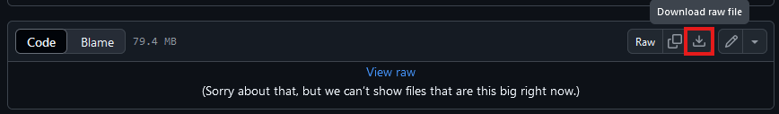

# 77th JSOC Medical Loadout Updater

This project is an advanced autoclicker that automates the modification of player loadouts in the game *Arma 3*. 

## Overview

The Python scripts adjust medical items in player profiles by interacting with the game interface. They replace items like saline with plasma and modify quantities of medical supplies.
These are in line with the latest 2024-11-20 Loadout changes regarding the medical test phase. 

## Features

- Automated replacement of medical supplies (e.g., saline to plasma).
- Modification of medical supply quantities: 20x Basic bandages -> 10x Basic bandages & 10x packing bandages

## Getting Started

This script clicks on certain parts of your screen and presses keys (ESC, Down Arrow, Enter) to:
1. Load in your loadout.
2. Export it to the clipboard.
3. Modify this exported text to replace old medical equipment.
4. Copy the modified text back to your clipboard.
5. Use the Arsenal's import function to read the updated loadout.
6. Save it in place of the old loadout.

This is an automated way to bring all your loadouts up to standard, but there is no guarantee.
You are ultimately responsible for your loadouts.

### Executable files

I provide compiled .exe files for both Arsenal systems (ACE and Vanilla). 
If you do not know how to run a Python script, I suggest that you use this method.
They are located in the [Executables](./Executables/) directory for both Arsenal types.
Click on [automaticACE_simple.exe](./Executables/automaticACE_simple.exe) or [automaticVanilla_simple.exe](./Executables/automaticVanilla_simple.exe) and you will find a _Download raw file_ button on the top right like this:
 

## Usage

After downloading the executables follow these instructions:
1. **BACKUP** your Arma3 profile. This will prevent data loss and make it easier to roll back.
2. In your Windows settings, set your primary Display Resolution to **1920x1080** and Scale to **100%**. The script is designed for UI elements displayed on screens like this to maximize accesibility.
3. Launch Arma3 with the modpack.
4. Open Options / Video / Display Settings and set the Display mode to _Fullscreen Window_ (run Arma3 on your primary display). Set the interface size to _Small_.
5. In the Main menu open Tutorials / Virtual (Vanilla) Arsenal or ACE Arsenal.
6. Stay on the opening view of the respective arsenal.
7. Run the downloaded executable as Administrator (it may work without).
8. Switch (ALT+TAB) back to Arma3, you have 10 seconds before clicking starts.
9. Let the script run, do not touch anything. By default it will check 100 ACE loadouts and 300 Vanilla loadouts.
11. **BACKSPACE to STOP**. If you have less or want to stop to check if everything is okay, press BACKSPACE. This will stop the script. (If this does not work, try closing the command window, a bit tricky with all those clicks). When you restart the script, it will start from the beginning. 
12. **Success**! You should have plasma instead of saline and 10x Packing bandage and 10x Basic bandage instead of 20x Basic bandage.
13. Manually change your medic loadouts to add the new equipment and remove extra Packing bandages. 

I encourage you to check the corresponding `.py` scripts before running executables on your system, and if you can, I encourage you to run the python scripts, details are in [How to run the scripts](./scriptREADME.md).

## Contact

For assistance, please contact [Spc.] LeX.

## Disclaimer

This is not an official / endorsed tool from Logistics!
It is in an experimental stage and I welcome any constructive feedback. 
